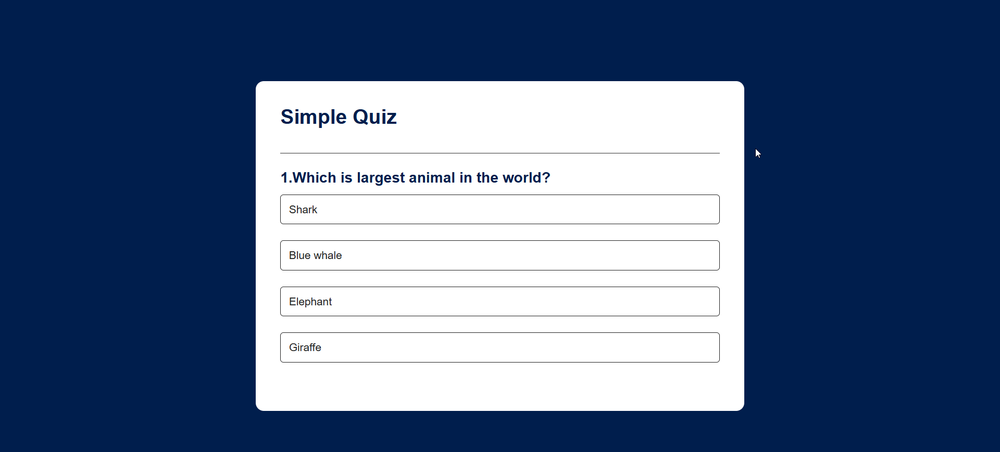
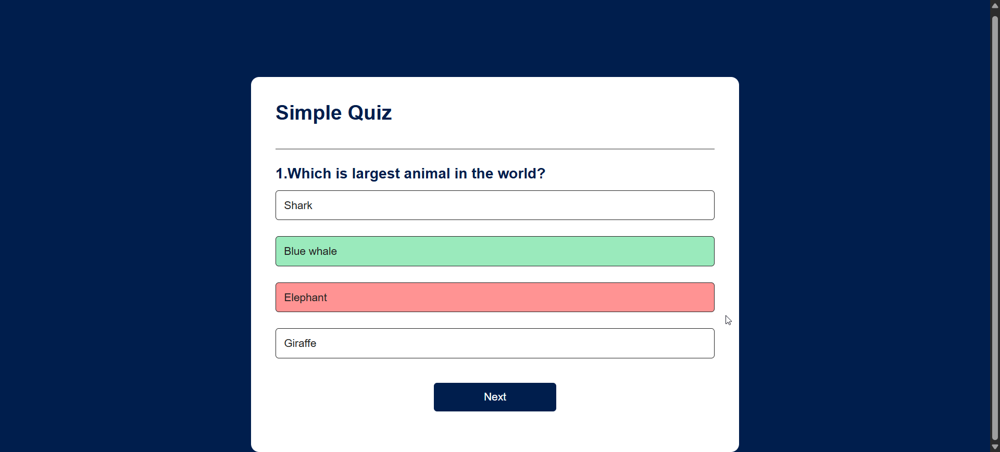

# 🧠 Quiz App

A simple and interactive Quiz Application built using **HTML, CSS, and JavaScript**. This project allows users to answer multiple-choice questions, track their scores, and test their knowledge through an engaging quiz experience.

---

## 📌 Features

- ✅ Multiple-choice questions
- ✅ Instant answer validation
- ✅ Score tracking
- ✅ User-friendly interface
- ✅ Responsive design
- ✅ Final result display

---

## 🚀 Technologies Used

- HTML5
- CSS3
- JavaScript (ES6)

---

## 📂 Project Structure

```text
Quiz_App/
│
├── index.html
├── style.css
├── app.js
├── images/
│   └── home.png
    └── quiz.png
    └── result.png
└── README.md
```

---

## 📸 Screenshots

### Home Screen





### Quiz Interface




### Result Screen


---

## ⚙️ Installation & Usage

### Clone the Repository

```bash
git clone https://github.com/Pinkykumari9546/Quiz_App.git
```

### Navigate to the Project Folder

```bash
cd Quiz_App
```

### Run the Project

Open `index.html` in your browser.

---

## 🎯 How to Use

1. Start the quiz.
2. Read the question carefully.
3. Select the correct option.
4. Move to the next question.
5. Complete all questions.
6. View your final score.

---

## 👨‍💻 Author

**Pinky Kumari**

GitHub: https://github.com/Pinkykumari9546

---

## ⭐ Support

If you found this project helpful, please give it a ⭐ on GitHub!

---

### Made with ❤️ using HTML, CSS & JavaScript
